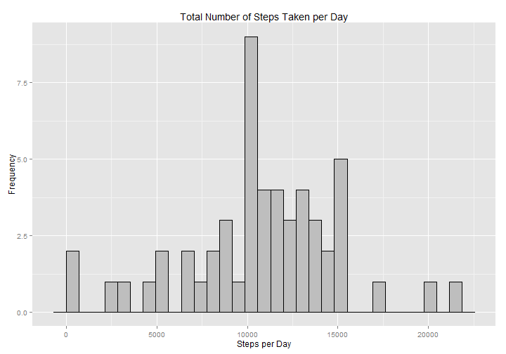
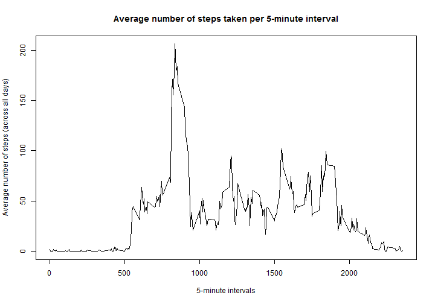
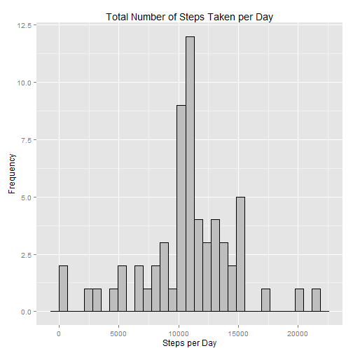
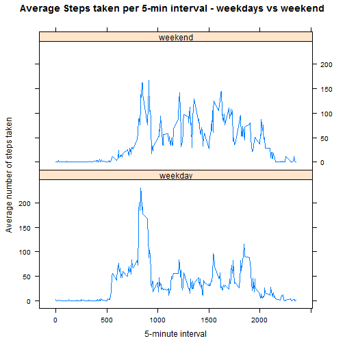

Reproducible Research Assignment 1 - Quantifiable Self
========================================================


## Loading and preprocessing the data

```r
data <- read.csv("activity.csv", header=T)       ## Reading in the data
str(data)
```

```
## 'data.frame':	17568 obs. of  3 variables:
##  $ steps   : int  NA NA NA NA NA NA NA NA NA NA ...
##  $ date    : Factor w/ 61 levels "2012-10-01","2012-10-02",..: 1 1 1 1 1 1 1 1 1 1 ...
##  $ interval: int  0 5 10 15 20 25 30 35 40 45 ...
```

```r
data$date <- as.Date(data$date)                  ## Convert variable into class "Date"
```


## What is mean total number of steps taken per day?
Aggregating the data to total steps per day, while ignoring the missing values: 

```r
totalsteps <- aggregate(data$steps, by=list(date=data$date), sum)
colnames(totalsteps) <- c("date", "totalsteps")
head(totalsteps)
```

```
##         date totalsteps
## 1 2012-10-01         NA
## 2 2012-10-02        126
## 3 2012-10-03      11352
## 4 2012-10-04      12116
## 5 2012-10-05      13294
## 6 2012-10-06      15420
```

Making a **histogram** of the total number of steps taken each day: 


```r
library(ggplot2)
qplot(totalsteps, data=totalsteps)+geom_histogram(fill="grey", color="black")+labs(title="Total Number of Steps Taken per Day", x="Steps per Day", y="Frequency")
```

```
## stat_bin: binwidth defaulted to range/30. Use 'binwidth = x' to adjust this.
## stat_bin: binwidth defaulted to range/30. Use 'binwidth = x' to adjust this.
```

 

Calculate the **mean** total number of steps taken per day: 

```r
mean(totalsteps$totalsteps, na.rm=T)
```

```
## [1] 10766
```
The mean of total number of steps per day is 1.0766 &times; 10<sup>4</sup>. 

And the **median** total number of steps taken per day: 

```r
median(totalsteps$totalsteps, na.rm=T)
```

```
## [1] 10765
```
The median is 10765. 


## What is the average daily activity pattern?

Making a **time series plot**:

```r
library(plyr)
totalstepsinterval <- ddply(data, .(interval), summarise, mean_steps=mean(steps, na.rm=TRUE))
head(totalstepsinterval)
```

```
##   interval mean_steps
## 1        0    1.71698
## 2        5    0.33962
## 3       10    0.13208
## 4       15    0.15094
## 5       20    0.07547
## 6       25    2.09434
```

```r
plot(totalstepsinterval, type="l", main="Average number of steps taken per 5-minute interval", xlab="5-minute intervals", ylab="Average number of steps (across all days)")
```

 

Display the 5-minute interval that contains the maximum number of steps: 

```r
max <- totalstepsinterval[which.max(totalstepsinterval$mean_steps),]
max 
```

```
##     interval mean_steps
## 104      835      206.2
```
The maximum number of steps are in the 835th interval. 


## Imputing missing values

Report the total number of missing values in the dataset: 

```r
sum(is.na(data$steps))
```

```
## [1] 2304
```
There are 2304 rows with missing values. 

The imputation method chosen here is to replace the missing value by the average of that 5-minute interval.

```r
totalstepsinterval <- ddply(data, .(interval), summarise, mean_steps=mean(steps, na.rm=TRUE))
```

Creating a new dataset with imputed values:
First, merge the data with missing values with the means per 5-minute interval. 

```r
data_imputed <- data
data_imputed <- merge(data_imputed, totalstepsinterval, by="interval")
```
Next, replace the NA values in a 5-minute interval by the corresponding mean value.

```r
for(i in 1:nrow(data_imputed)) {
    
    if(is.na(data_imputed$steps[i])){
        data_imputed$steps[i] <- data_imputed$mean_steps[i]
    }
}    
```
Verifying that there are no remaining missing values. No missing values anymore, so imputation worked. 

```r
sum(is.na(data_imputed$steps))
```

```
## [1] 0
```


Making a **histogram** of the total number of steps taken each day: 

```r
newtotalsteps <- aggregate(data_imputed$steps, by=list(date=data_imputed$date), sum)
colnames(newtotalsteps) <- c("date", "totalsteps")
head(newtotalsteps)
```

```
##         date totalsteps
## 1 2012-10-01      10766
## 2 2012-10-02        126
## 3 2012-10-03      11352
## 4 2012-10-04      12116
## 5 2012-10-05      13294
## 6 2012-10-06      15420
```

```r
qplot(totalsteps, data=newtotalsteps)+geom_histogram(fill="grey", color="black")+labs(title="Total Number of Steps Taken per Day", x="Steps per Day", y="Frequency")
```

```
## stat_bin: binwidth defaulted to range/30. Use 'binwidth = x' to adjust this.
## stat_bin: binwidth defaulted to range/30. Use 'binwidth = x' to adjust this.
```

 

Calculate the **mean** total number of steps taken per day: 

```r
mean(newtotalsteps$totalsteps, na.rm=T)
```

```
## [1] 10766
```
The mean of total number of steps per day is 1.0766 &times; 10<sup>4</sup>. 

And the **median** total number of steps taken per day: 

```r
median(newtotalsteps$totalsteps, na.rm=T)
```

```
## [1] 10766
```
The median is 1.0766 &times; 10<sup>4</sup>.

Initially the mean was 1.0766 &times; 10<sup>4</sup>and the median was 10765. This implies that the new mean, after imputation, is still the same and the median has only changed by 1 step. 
After imputation there is less variation in the data distribution because the missing values were replaced by overall averages. The new median is now equal to the mean, the data appears to be more centered. 

## Are there differences in activity patterns between weekdays and weekends?


```r
Sys.setlocale("LC_TIME", "English")                     ## Ensuring that the display language is in English
```

```
## [1] "English_United States.1252"
```

```r
data_imputed$weekday <- weekdays(data_imputed$date)                         ## Introducing weekday-variable
data_imputed$weekend <- as.factor(data_imputed$weekday %in% c("Saturday", "Sunday"))     ## Factor variable
levels(data_imputed$weekend) <- c("weekday", "weekend")                     ## weekday/weekend labels added
```

Make a **panel plot** for weekdays and weekends: 

Aggregating the data to averages per weekend or weekdays: 

```r
totalstepsweekend <- ddply(data_imputed, .(interval, weekend), summarise, avg_steps=mean(steps, na.rm=TRUE))
```
And then plotting the time series: 

```r
library(lattice)

xyplot(avg_steps ~ interval | weekend, data=totalstepsweekend, layout=c(1,2), type="l", xlab="5-minute interval", ylab="Average number of steps taken", main="Average Steps taken per 5-min interval - weekdays vs weekend")
```

 
